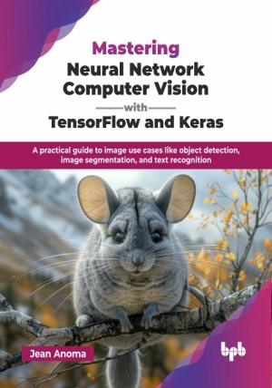

# Mastering Neural Network Computer Vision with TensorFlow and Keras

A practical guide to image use cases like object detection, image segmentation, and text recognition.

This is the repository for [Mastering Neural Network Computer Vision with TensorFlow and Keras
](https://bpbonline.com/products/mastering-neural-network-computer-vision-with-tensorflow-and-keras?variant=44334307639496),published by BPB Publications.

## About the Book
Mastering Neural Network Computer Vision with TensorFlow and Keras provides a comprehensive guide to using TensorFlow and Keras for computer vision applications. The book enables readers to develop and exercise the skills needed to use sophisticated pre-trained computer vision models, build simple and more advanced neural network models, and optimize their performance.

The different chapters of the book cover a comprehensive range of topics in computer vision and deep learning. The first chapter provides a theoretical introduction to computer vision and deep learning, and the second one provides an overview of TensorFlow and its capabilities. The subsequent chapters cover specific applications of neural networks in computer vision, such as image classification, image segmentation, and object detection, and how to tap into the power of transfer learning and pre-trained models to address those use cases. Finally, the remaining chapters cover how to design your own neural network, gather a proper dataset and train your model efficiently. They also cover image generation and ethical considerations around computer vision.

By the end of this book, readers will have a strong understanding of the principles of deep learning and computer vision, as well as the skills needed to build advanced neural network models using TensorFlow. 

## What You Will Learn
• Understand essential deep learning concepts and architectures specifically designed for modern computer vision applications.

• Build practical expertise with Tensorflow and Keras while implementing pre-trained models for vision tasks.

• Learn to fine-tune existing models and design new architectures for specific vision challenges.

• Master techniques to improve model efficiency, training speed, and overall performance in real applications.

• They will know how diffusion-based models work and how to use some of the most popular ones, like DALL-E or Stable Diffusion.
